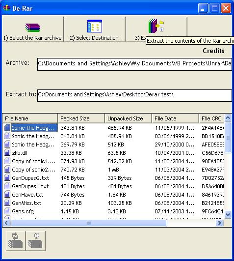



## DE\-RAR

### Description

Allows you to extract the contents of RAR archives and lists what files are in the archive. You will need the Unrar.dll which is on the WinRar site (Rarlabs i think) placed in the same Dir as the app, or in the c:\windows\system32 folder

-29/06/2006 - 3.0.1

--BugFixes and removed some unnessary declarations

-- Can drag an archive on the exe and it will auto enter it into the OpenRar text bo and list the files (i.e. allows archives to be opened by double clicking on it if there is no rar support available. Just select "open with")

-- Implemented another progressbar so that the user knows how many objects have been extracted and how many to go

-- Got rid of the label showing number of files in the archive

-- Sorted out the multi Volume archives so that the unpacked size doesn't get counted twice, therefore the progressbar is more reliable

-- Realised that WinRar doesn't tidy up the folders (i.e TopLevel shown by default until it is double clicked, which shows the second level files relative to the toplevel folder)

-- Tidied up some of the listing coding so that there are not two procedures to list files and folders separately, now there is just one (which may have caused the confusion with the treeview)

-- Scrapped the treeview as it was not the best idea I've had. Replaced it with a Listview which can show the file properties and cuts down on the extra part of the extraction function

-- Display archive Comments

-- Removed API of the List box so that it is scrollable as the Listbox has been removed

-- Changed borderstyle of form from Fixed single to sizable and allows controls to be resized as well (though it flashes the form when it reaches its limit)

-- Changed GUI so that a toolbar is used (may as well use the other items in MSCOMCTRL.OCX since its referenced), and got rid of the list files option. Its automatic now

-- List files doesn't list the files in the archive twice

-- Added ability to drop a rar archive on the input textbox

-- Fixed the process dialog so that long paths get wrapped

-- Implememented a treeview instead of listbox for files in the archive (though needs tweaking)
 
### More Info
 
The RAR Archive

This was made in a few sessions (e.g. when i first started learning VB and now when I'm a bit better)so some of the code probably isn't good practice. Also uses parts of other peoples code, which has been credited in the credits and in the IDE where possible

The extracted files

Resizing below limit set cause the form to flash since I not sure how to subclass the resize event

             |
---                |---
**Submitted On**   |2006-06-27 18:44:04
**By**             |[Ashley Butler](https://github.com/Planet-Source-Code/PSCIndex/blob/master/ByAuthor/ashley-butler.md)
**Level**          |Intermediate
**User Rating**    |4.7 (14 globes from 3 users)
**Compatibility**  |VB 5\.0, VB 6\.0
**Category**       |[Complete Applications](https://github.com/Planet-Source-Code/PSCIndex/blob/master/ByCategory/complete-applications__1-27.md)
**World**          |[Visual Basic](https://github.com/Planet-Source-Code/PSCIndex/blob/master/ByWorld/visual-basic.md)
**Archive File**   |[DE\-RAR2003426292006\.zip](https://github.com/Planet-Source-Code/ashley-butler-de-rar__1-65003/archive/master.zip)

### API Declarations

Quite a few

